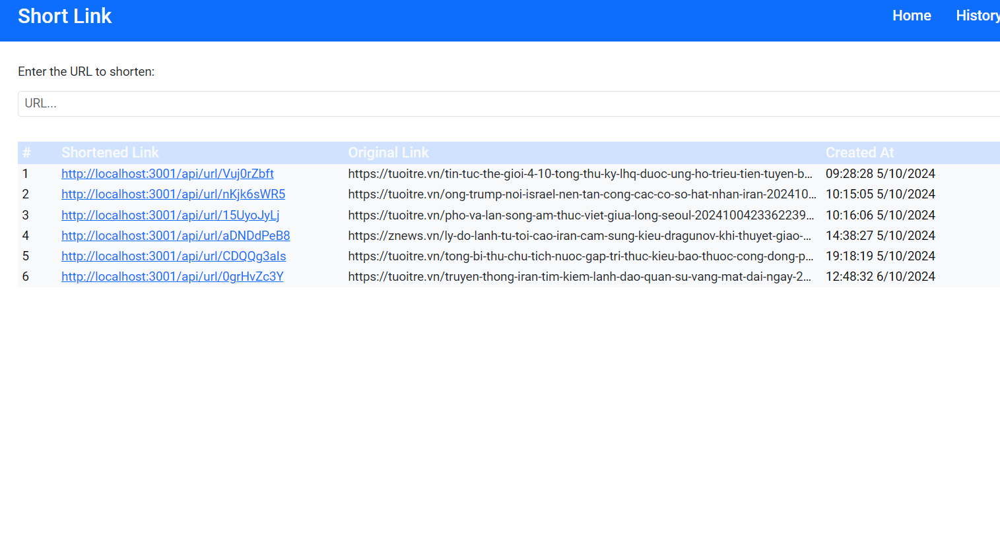

# Short Link Project

## Overview

This project is a **Short Link** application, which allows users to shorten long URLs into simpler, more manageable links. The project is built using **Node.js**, **React.js**, **MongoDB**, and **Mongoose**, and it uses **JWT (JSON Web Tokens)** for authentication.

## Features

- **User Authentication**: JWT-based authentication to secure user sessions.
- **URL Shortening**: Convert long URLs into short, manageable links.
- **User Histories**: Track the shortened URLs created by users along with visit data (including IP and location).
- **IP and Location Tracking**: Collect user IP and location for analytics purposes.
- **Responsive Design**: The application uses Bootstrap to provide a responsive user interface.
- **RESTful API**: Backend routes for creating short URLs, tracking visits, and user management.

## Tech Stack

- **Backend**:
  - **Node.js**: Backend server for handling requests and managing logic.
  - **Express.js**: Web framework used for routing and handling API requests.
  - **MongoDB**: NoSQL database to store user and URL data.
  - **Mongoose**: ODM (Object Data Modeling) for MongoDB, used to interact with the database.
  - **JWT**: For user authentication and secure session handling.

- **Frontend**:
  - **React.js**: For building the user interface and handling user interactions.
  - **Bootstrap**: For responsive design and layout.
  - **React Router**: For handling navigation and routing in the frontend.
  - **Axios**: For making API requests in the frontend.

## Installation and Setup

### Prerequisites

Before running this project, make sure you have the following installed:

- **Node.js** (version 12 or higher)
- **MongoDB** (You can use MongoDB Atlas or run it locally)
- **NPM** or **Yarn**

### Installation

1. **Clone the repository**:

   ```bash
   git clone https://github.com/your-username/short-link.git
   ```

2. **Navigate to the project directory**:

   ```bash
   cd short-link
   npm start
   ```

3. **Install dependencies for both backend and frontend**:

   - Backend:

     ```bash
     cd backend
     npm install
     ```

   - Frontend:

     ```bash
     cd frontend
     npm install
     ```

4. **Set up environment variables**:

   In the `backend` folder, create a `.env` file and add the following:

   ```env
   MONGODB_URL=your-mongodb-connection-string
   JWT_ACCESS_SECRET=your-jwt-secret
   JWT_REFRESH_SECRET=your-jwt-refresh-secret
   CLIENT_URL=http://localhost:5173
   NODE_ENV=development
   ```

5. **Start the development server**:

   - Backend:

     ```bash
     cd backend
     npm run dev
     ```

   - Frontend:

     ```bash
     cd frontend
     npm start
     ```

6. Open your browser and navigate to `http://localhost:5173`.

## API Endpoints
- **GET /track-location/:shortId** - Save the location and ip address
- **POST /api/url/shorten/:userId** - Create a new shortened URL
- **GET /api/url/shorten/:shortId** - Redirect to the original URL using the short link
- **GET /api/url/:userId/histories** - Get the list of shortened URLs created by a user

## Usage

1. **Sign up** or **Log in** to the application.
2. Enter the long URL you want to shorten and click "Create".
3. Copy and share the generated short link.
4. Track the number of clicks and the details of visitors (IP, location).

## Screenshots

### Home Page

